# List of all docker command executed

### docker --version
>

### docker images
>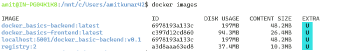

### docker ps
>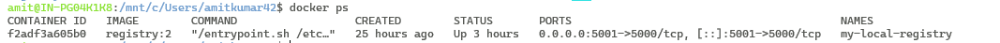

### docker ps -a
>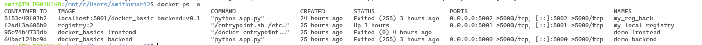

### docker rmi  &nbsp;&nbsp;(*forced*)
>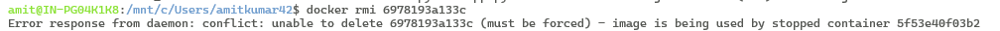
>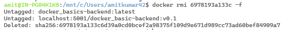

### docker rm   &nbsp;&nbsp;(*forced*)
>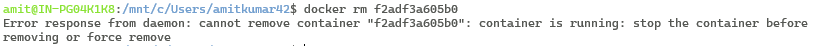
>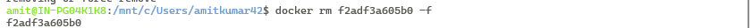

### docker rm &nbsp;&nbsp;(*Remove all containers*)
>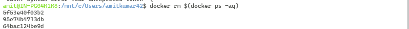
>

### docker rmi &nbsp;&nbsp;(*Remove all images*)
>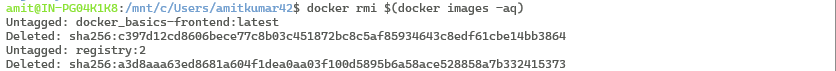
>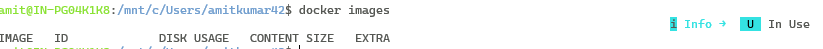

### docker build . &nbsp;&nbsp;(*normal at current folder / directory, no tag*)
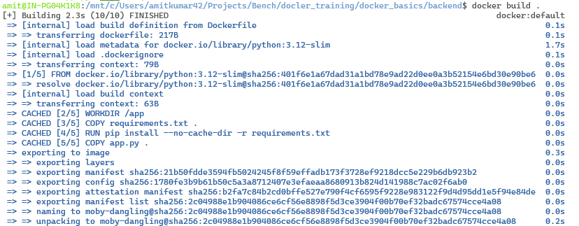

### docker build -t demo-backend:v0.1 . &nbsp;&nbsp;(*tagged docker image*)
>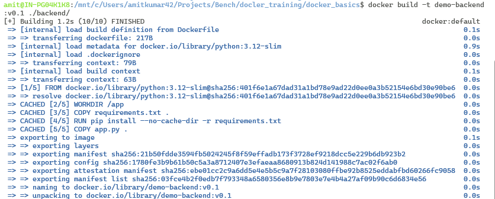

### docker build --no-cache -t demo-backend-no-cache:v0.2 ./backend/ &nbsp;&nbsp;(*no cache used, fresh image from source*)
>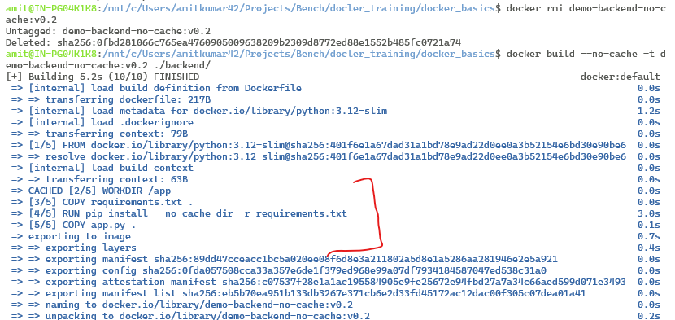

### docker build -t image_tag-name -f docker-file-name .  &nbsp;&nbsp; (*-f if Dockerfile has custom name*)

### docker run <image_id>  &nbsp;&nbsp;(*container forground run command*)
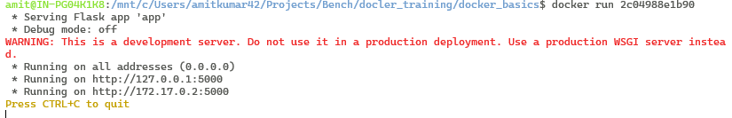

___
### docker run <image_id>  &nbsp;&nbsp;(*container detached mode run command*)
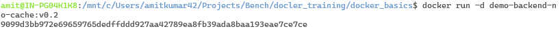

___
### docker run -d -p <host_computer_port>:<container_service_port> <image_id>  &nbsp;&nbsp;(*container port mapping to host*)
*now app can be accessed in computer on port 8080*
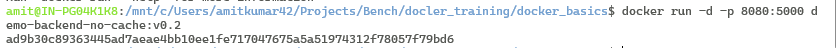

___
### docker exec -it <container_id / name> /bin/sh  &nbsp;&nbsp;(*interacting with container's terminal*)
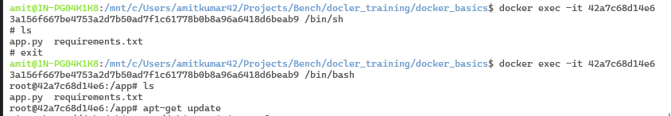

___
### Accessing app from inside container's terminal
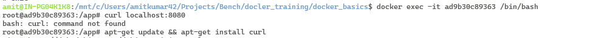
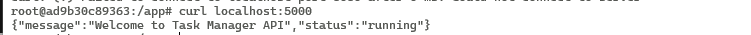

___
### docker stop <container_id or name> 
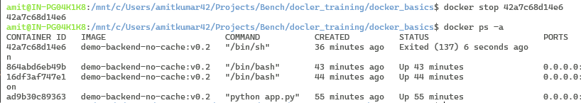

___
### dcoker images prune  &nbsp;&nbsp;(*dleteing all unused images in one go*)
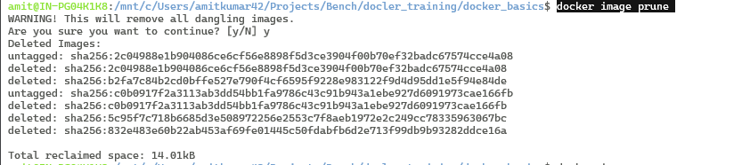

___
### docker compose build &nbsp;&nbsp;(*Build based on the docker compose file*)
docker compose up -d --build &nbsp;&nbsp;(*Build and start in detached mode*)
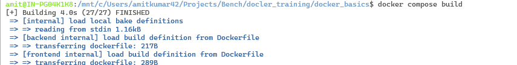

___
### docker compose up -d &nbsp;&nbsp;(*Start container in detached mode*) 
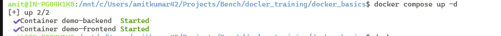

___
### docker compose exec <service_name_from_dockerFile> sh &nbsp;&nbsp;(*Log into the running service container*) 
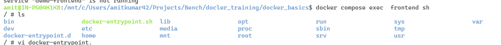

___
### docker run -d -p 5001:5000 --restart=always --name local-registry registry:2 &nbsp;&nbsp;(*Run official local registry*) 
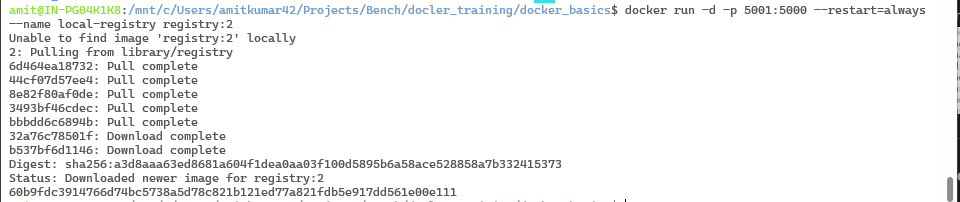

___
### docker tag docker_basics-backend:latest localhost:5001/docker_basic-backend:v0.1 &nbsp;&nbsp;(*Tag existing image for docker registry*) 
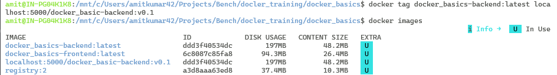

___
### docker push localhost:5001/docker_basic-backend:v0.1 &nbsp;&nbsp;(*Push existing image to local registry*) 
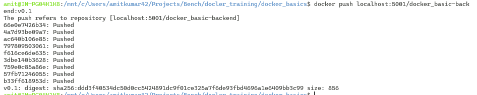

___
### curl http://localhost:5000/v2/_catalog &nbsp;&nbsp;(*Verify if images pushed*) 
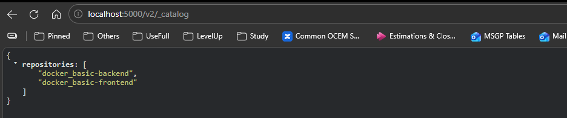\

___
###  docker run -d -p 5001:5000 localhost:5000/docker_basic-backend:v0.1 &nbsp;&nbsp;(*pull and run image from local*) 
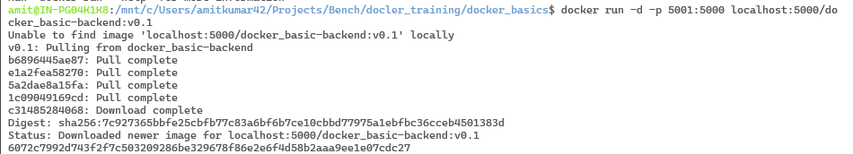